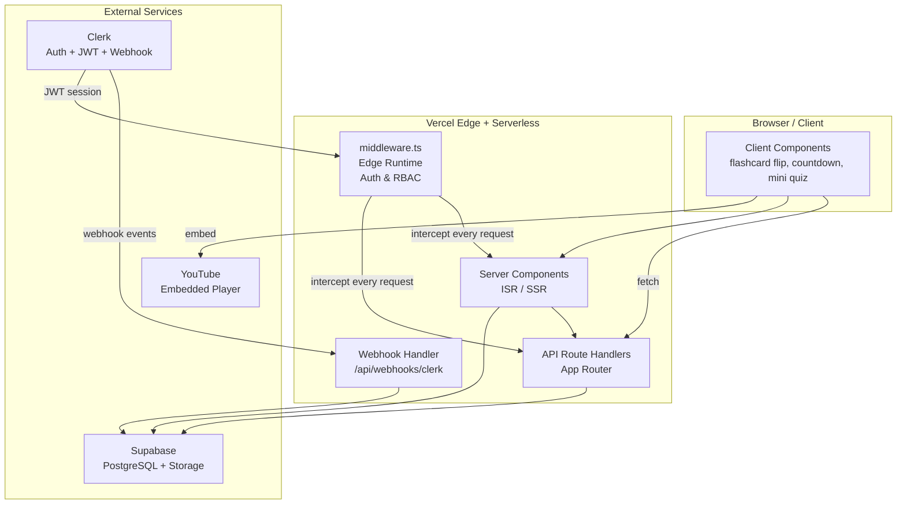
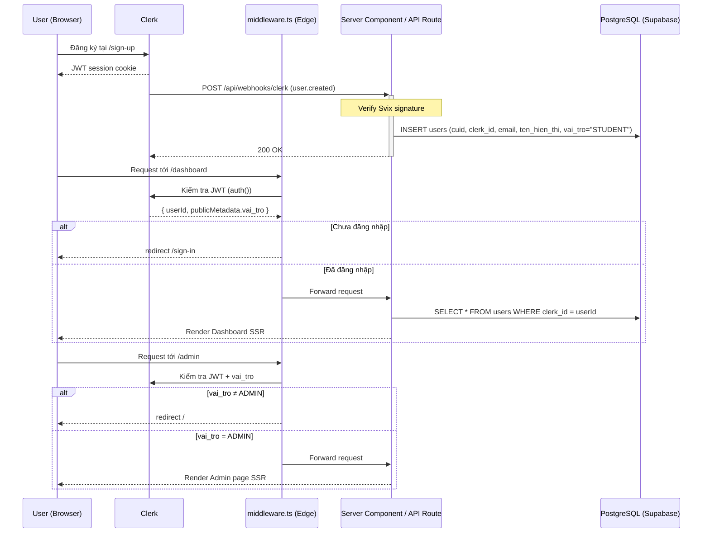
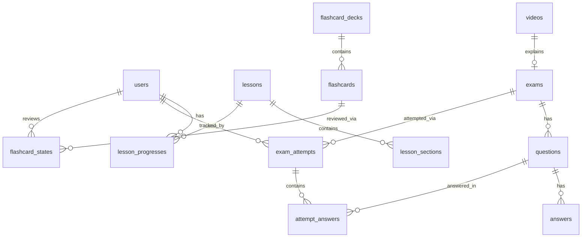
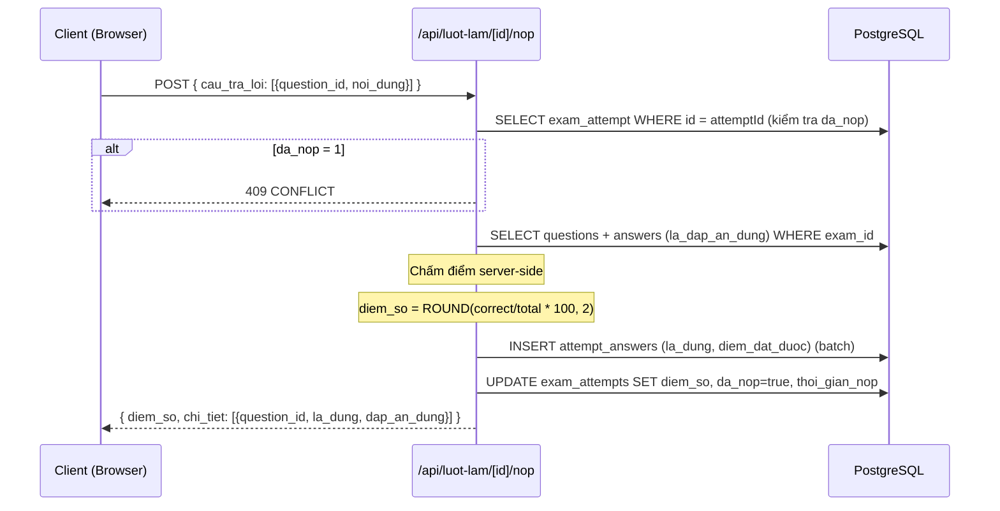
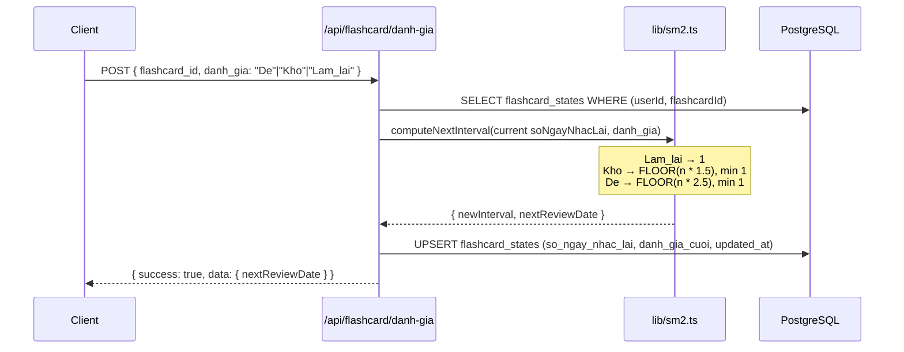
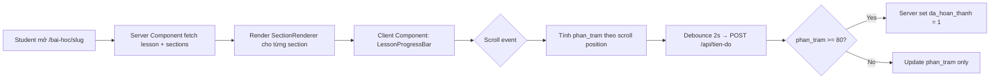

# Tài liệu Thiết kế Kỹ thuật — FrenchGo Platform

## Overview

FrenchGo là nền tảng học tiếng Pháp trực tuyến dành cho học sinh và sinh viên Việt Nam, hỗ trợ 4 cấp độ A1→B2 theo khung CEFR. Hệ thống gồm 5 module chính: Lesson System (bài học đa dạng theo chủ đề), Flashcard System (ôn tập từ vựng SM-2), Exam System (thi trắc nghiệm có tính giờ với chấm điểm server-side), Dashboard (theo dõi tiến độ cá nhân) và Admin Panel (quản lý toàn bộ nội dung).

**Tech Stack chính:**
- Next.js 16 (App Router) + TypeScript strict mode
- Tailwind CSS v4 + Shadcn UI
- Framer Motion (animations)
- Prisma ORM + PostgreSQL (Supabase)
- Clerk (authentication & user management)
- Supabase Storage (media files)
- Vercel (deployment + Edge Middleware)

**Nguyên tắc thiết kế:**
- Server Components là mặc định — `"use client"` chỉ khi thực sự cần tương tác
- ISR cho nội dung công khai, SSR cho dữ liệu riêng tư
- Mọi input từ client đều validate qua Zod trước khi chạm DB
- Không bao giờ lộ `la_dap_an_dung` cho client khi đang làm bài
- TypeScript strict — không dùng `any`


---

## Architecture

### Sơ đồ kiến trúc tổng quan



### Chiến lược Rendering

| Trang / Route | Chiến lược | Lý do |
|---|---|---|
| `/` (trang chủ) | ISR (revalidate: 300s) | Nội dung ổn định, SEO quan trọng |
| `/bai-hoc` | ISR (revalidate: 300s) | Danh sách bài học công khai |
| `/bai-hoc/[slug]` | ISR (revalidate: 300s) | Chi tiết bài học, cần SEO |
| `/de-thi` | ISR (revalidate: 300s) | Danh sách đề thi công khai |
| `/de-thi/[id]` | SSR | Cần ẩn `la_dap_an_dung` |
| `/flashcard` | ISR (revalidate: 300s) | Danh sách deck công khai |
| `/dashboard` | SSR (no-cache) | Dữ liệu riêng tư, luôn mới |
| `/ket-qua/[id]` | SSR (no-cache) | Kết quả cá nhân |
| `/admin/*` | SSR (no-cache) | Admin cần real-time data |


---

## Cấu trúc thư mục (File/Folder Structure)

```
d:\french-learning\
├── app/
│   ├── layout.tsx                        ← Root layout (Exo font, ClerkProvider)
│   ├── globals.css                       ← Tailwind v4 directives + CSS variables
│   ├── (public)/                         ← Route group: không cần đăng nhập
│   │   ├── page.tsx                      ← Trang chủ (ISR)
│   │   ├── bai-hoc/
│   │   │   ├── page.tsx                  ← Danh sách bài học (ISR)
│   │   │   └── [slug]/
│   │   │       └── page.tsx              ← Chi tiết bài học (ISR)
│   │   ├── de-thi/
│   │   │   ├── page.tsx                  ← Danh sách đề thi (ISR)
│   │   │   └── [id]/
│   │   │       └── page.tsx              ← Trang làm bài (SSR, Client Component timer)
│   │   ├── flashcard/
│   │   │   └── page.tsx                  ← Danh sách deck (ISR)
│   │   ├── sign-in/[[...sign-in]]/
│   │   │   └── page.tsx                  ← Clerk SignIn component
│   │   └── sign-up/[[...sign-up]]/
│   │       └── page.tsx                  ← Clerk SignUp component
│   ├── (student)/                        ← Route group: cần đăng nhập
│   │   ├── layout.tsx                    ← Layout kiểm tra auth
│   │   ├── dashboard/
│   │   │   └── page.tsx                  ← Dashboard (SSR no-cache)
│   │   ├── flashcard/
│   │   │   └── [id]/
│   │   │       └── page.tsx              ← Session ôn tập (Client Component)
│   │   └── ket-qua/
│   │       └── [id]/
│   │           └── page.tsx              ← Chi tiết kết quả thi (SSR)
│   ├── admin/                            ← Chỉ ADMIN
│   │   ├── layout.tsx                    ← Layout kiểm tra ADMIN role
│   │   ├── page.tsx                      ← Admin home redirect
│   │   ├── bai-hoc/
│   │   │   ├── page.tsx                  ← Danh sách bài học (SSR)
│   │   │   ├── tao-moi/page.tsx          ← Form tạo bài học
│   │   │   └── [id]/chinh-sua/page.tsx   ← Form sửa bài học
│   │   ├── flashcard/
│   │   │   ├── page.tsx                  ← Danh sách deck
│   │   │   └── [id]/page.tsx             ← Quản lý thẻ trong deck
│   │   ├── de-thi/
│   │   │   ├── page.tsx                  ← Danh sách đề thi
│   │   │   └── [id]/page.tsx             ← Quản lý câu hỏi
│   │   ├── nguoi-dung/
│   │   │   └── page.tsx                  ← Danh sách users (SSR)
│   │   └── thong-ke/
│   │       └── page.tsx                  ← Thống kê hệ thống (SSR)
│   └── api/
│       ├── webhooks/
│       │   └── clerk/route.ts            ← Clerk webhook (Svix verify)
│       ├── bai-hoc/
│       │   ├── route.ts                  ← GET (public), POST (admin)
│       │   └── [id]/route.ts             ← PUT, DELETE (admin)
│       ├── tien-do/
│       │   └── route.ts                  ← GET, POST (student)
│       ├── flashcard/
│       │   ├── bo-the/
│       │   │   ├── route.ts              ← GET (public), POST (admin)
│       │   │   └── [id]/route.ts         ← DELETE (admin)
│       │   ├── the/
│       │   │   ├── route.ts              ← POST (admin)
│       │   │   └── [id]/route.ts         ← PUT, DELETE (admin)
│       │   ├── on-tap/route.ts           ← GET (student)
│       │   └── danh-gia/route.ts         ← POST (student)
│       ├── de-thi/
│       │   ├── route.ts                  ← GET (public), POST (admin)
│       │   └── [id]/
│       │       ├── route.ts              ← GET (public), DELETE (admin)
│       │       └── cau-hoi/route.ts      ← POST (admin)
│       ├── luot-lam/
│       │   ├── route.ts                  ← POST (student) — tạo attempt
│       │   └── [id]/
│       │       └── nop/route.ts          ← POST (student) — nộp bài + chấm điểm
│       ├── nguoi-dung/
│       │   └── toi/route.ts              ← GET, PUT (student)
│       └── admin/
│           └── nguoi-dung/
│               ├── route.ts              ← GET (admin)
│               └── [id]/
│                   └── vai-tro/route.ts  ← PUT (admin)
├── components/
│   ├── ui/                               ← Shadcn UI components (auto-generated)
│   ├── lesson/
│   │   ├── LessonCard.tsx                ← Card bài học (Server Component)
│   │   ├── LessonFilter.tsx              ← Bộ lọc cấp độ/chủ đề (Client Component)
│   │   ├── LessonProgressBar.tsx         ← Thanh tiến độ (Client Component)
│   │   ├── SectionRenderer.tsx           ← Render từng loại section (Server Component)
│   │   └── MiniQuiz.tsx                  ← Quiz tương tác (Client Component)
│   ├── flashcard/
│   │   ├── DeckCard.tsx                  ← Card bộ thẻ (Server Component)
│   │   ├── FlashcardFlip.tsx             ← Thẻ lật (Client Component, Framer Motion)
│   │   ├── RatingButtons.tsx             ← Nút Dễ/Khó/Làm lại (Client Component)
│   │   └── StudySession.tsx              ← Session ôn tập (Client Component)
│   ├── exam/
│   │   ├── ExamCard.tsx                  ← Card đề thi (Server Component)
│   │   ├── CountdownTimer.tsx            ← Đếm ngược (Client Component)
│   │   ├── QuestionList.tsx              ← Danh sách câu hỏi (Client Component)
│   │   └── ResultDetail.tsx              ← Chi tiết kết quả (Server Component)
│   ├── dashboard/
│   │   ├── ProgressSummary.tsx           ← Tổng quan tiến độ
│   │   ├── ExamHistory.tsx               ← Lịch sử thi
│   │   └── FlashcardStats.tsx            ← Thống kê flashcard
│   └── shared/
│       ├── Navbar.tsx                    ← Navigation bar
│       ├── LevelBadge.tsx                ← Badge A1/A2/B1/B2
│       └── EmptyState.tsx                ← Trạng thái trống
├── lib/
│   ├── prisma.ts                         ← Prisma singleton
│   ├── auth.ts                           ← Helper: getCurrentUser()
│   ├── sm2.ts                            ← SM-2 algorithm (pure functions)
│   ├── slug.ts                           ← Slug generator
│   ├── api-response.ts                   ← Response helpers: ok(), err()
│   └── validations/
│       ├── lesson.ts                     ← Zod schemas bài học
│       ├── flashcard.ts                  ← Zod schemas flashcard
│       ├── exam.ts                       ← Zod schemas đề thi
│       └── user.ts                       ← Zod schemas user
├── middleware.ts                         ← Vercel Edge Middleware
├── prisma/
│   └── schema.prisma                     ← Prisma schema
└── types/
    └── index.ts                          ← Shared TypeScript types
```


---

## Components and Interfaces

### Luồng xác thực (Auth Flow)



### Middleware Architecture

```typescript
// middleware.ts — Vercel Edge Runtime
// Đọc vai_tro từ Clerk JWT publicMetadata (không query DB)
// Phân loại routes:
//   ADMIN_ROUTES:  /admin(/*)?  và  /api/admin(/.*)?
//   STUDENT_ROUTES: /dashboard(/*)?  /flashcard/(.*)?  /ket-qua(/*)?  /api/tien-do(/.*)?
//                   /api/flashcard/on-tap  /api/flashcard/danh-gia  /api/luot-lam(/.*)?
//   PUBLIC_ROUTES: /  /bai-hoc(/.*)?  /de-thi(/.*)?  /sign-in(/.*)?  /sign-up(/.*)?
//                  /api/bai-hoc(/.*)?  /api/de-thi(/.*)?  /api/flashcard/bo-the(/.*)?
//                  /api/webhooks(/.*)?
```

### API Response Helpers (`lib/api-response.ts`)

```typescript
// Chuẩn hóa response cho tất cả API routes
export type ApiSuccess<T> = { success: true; data: T }
export type ApiError = { success: false; error: { code: string; message: string } }

export function ok<T>(data: T, status = 200): Response
export function err(code: string, message: string, status: number): Response

// Mapping HTTP status:
// ok()           → 200
// err("UNAUTHORIZED", ..., 401)
// err("FORBIDDEN", ..., 403)
// err("NOT_FOUND", ..., 404)
// err("CONFLICT", ..., 409)
// err("VALIDATION_ERROR", ..., 422)
```

### Auth Helper (`lib/auth.ts`)

```typescript
// getCurrentUser(): Lấy user từ DB dựa trên Clerk session
// Dùng trong Server Components và API Routes
export async function getCurrentUser(): Promise<User | null>
export async function requireAuth(): Promise<User> // throws 401 nếu chưa đăng nhập
export async function requireAdmin(): Promise<User> // throws 403 nếu không phải ADMIN
```


---

## Data Models

### Prisma Schema

```prisma
// prisma/schema.prisma
generator client {
  provider = "prisma-client-js"
}

datasource db {
  provider = "postgresql"
  url      = env("DATABASE_URL")
}

model User {
  id           String  @id @default(cuid())
  clerkId      String  @unique @map("clerk_id")
  email        String  @unique
  tenHienThi   String  @map("ten_hien_thi")
  vaiTro       String  @default("STUDENT") @map("vai_tro")

  lessonProgresses  LessonProgress[]
  examAttempts      ExamAttempt[]
  flashcardStates   FlashcardState[]

  @@map("users")
}

model Video {
  id        String  @id @default(cuid())
  tieuDe    String  @map("tieu_de")
  youtubeId String  @map("youtube_id")
  moTa      String? @map("mo_ta")
  level     String?
  isPublish Boolean @default(false) @map("is_publish")

  exams Exam[]

  @@map("videos")
}

model Lesson {
  id           String  @id @default(cuid())
  slug         String  @unique
  tieuDe       String  @map("tieu_de")
  level        String
  chuDe        String  @map("chu_de")
  anhBia       String? @map("anh_bia")
  thoiGianDoc  Int     @default(5) @map("thoi_gian_doc")
  isPublish    Boolean @default(false) @map("is_publish")

  sections   LessonSection[]
  progresses LessonProgress[]

  @@map("lessons")
}

model LessonSection {
  id        String @id @default(cuid())
  lessonId  String @map("lesson_id")
  loai      String
  noiDung   String @map("noi_dung") // JSON string
  thuTu     Int    @default(0) @map("thu_tu")

  lesson Lesson @relation(fields: [lessonId], references: [id], onDelete: Cascade)

  @@map("lesson_sections")
}

model LessonProgress {
  id           String  @id @default(cuid())
  userId       String  @map("user_id")
  lessonId     String  @map("lesson_id")
  phanTram     Int     @default(0) @map("phan_tram")
  daHoanThanh  Boolean @default(false) @map("da_hoan_thanh")

  user   User   @relation(fields: [userId], references: [id])
  lesson Lesson @relation(fields: [lessonId], references: [id])

  @@unique([userId, lessonId])
  @@map("lesson_progresses")
}

model FlashcardDeck {
  id        String  @id @default(cuid())
  tieuDe    String  @map("tieu_de")
  moTa      String? @map("mo_ta")
  level     String?
  isPublish Boolean @default(false) @map("is_publish")

  flashcards Flashcard[]

  @@map("flashcard_decks")
}

model Flashcard {
  id         String  @id @default(cuid())
  deckId     String  @map("deck_id")
  tuPhap     String  @map("tu_phap")
  nghiaViet  String  @map("nghia_viet")
  phatAm     String? @map("phat_am")
  viDu       String? @map("vi_du")
  audioUrl   String? @map("audio_url")

  deck   FlashcardDeck   @relation(fields: [deckId], references: [id], onDelete: Cascade)
  states FlashcardState[]

  @@map("flashcards")
}

model FlashcardState {
  id              String  @id @default(cuid())
  userId          String  @map("user_id")
  flashcardId     String  @map("flashcard_id")
  soNgayNhacLai   Int     @default(1) @map("so_ngay_nhac_lai")
  danhGiaCuoi     String? @map("danh_gia_cuoi")
  updatedAt       DateTime @updatedAt @map("updated_at")

  user      User      @relation(fields: [userId], references: [id])
  flashcard Flashcard @relation(fields: [flashcardId], references: [id])

  @@unique([userId, flashcardId])
  @@map("flashcard_states")
}
```


```prisma
model Exam {
  id           String  @id @default(cuid())
  tieuDe       String  @map("tieu_de")
  moTa         String? @map("mo_ta")
  level        String
  thoiGianLam  Int     @default(45) @map("thoi_gian_lam")
  isPublish    Boolean @default(false) @map("is_publish")
  videoId      String? @map("video_id")

  video     Video?      @relation(fields: [videoId], references: [id], onDelete: SetNull)
  questions Question[]
  attempts  ExamAttempt[]

  @@map("exams")
}

model Question {
  id         String  @id @default(cuid())
  examId     String  @map("exam_id")
  loai       String  @default("MULTIPLE_CHOICE")
  noiDung    String  @map("noi_dung")
  giaiThich  String? @map("giai_thich")
  thuTu      Int     @default(0) @map("thu_tu")

  exam            Exam            @relation(fields: [examId], references: [id], onDelete: Cascade)
  answers         Answer[]
  attemptAnswers  AttemptAnswer[]

  @@map("questions")
}

model Answer {
  id            String  @id @default(cuid())
  questionId    String  @map("question_id")
  noiDung       String  @map("noi_dung")
  laDapAnDung   Boolean @default(false) @map("la_dap_an_dung")

  question Question @relation(fields: [questionId], references: [id], onDelete: Cascade)

  @@map("answers")
}

model ExamAttempt {
  id            String    @id @default(cuid())
  userId        String    @map("user_id")
  examId        String    @map("exam_id")
  diemSo        Float?    @map("diem_so")
  daDo          Boolean   @default(false) @map("da_do")
  thoiGianLam   Int       @default(0) @map("thoi_gian_lam")
  daNop         Boolean   @default(false) @map("da_nop")
  thoiGianNop   DateTime? @map("thoi_gian_nop")

  user           User            @relation(fields: [userId], references: [id])
  exam           Exam            @relation(fields: [examId], references: [id])
  attemptAnswers AttemptAnswer[]

  @@map("exam_attempts")
}

model AttemptAnswer {
  id          String  @id @default(cuid())
  attemptId   String  @map("attempt_id")
  questionId  String  @map("question_id")
  cauTraLoi   String? @map("cau_tra_loi")
  laDung      Boolean @default(false) @map("la_dung")
  diemDatDuoc Int     @default(0) @map("diem_dat_duoc")

  attempt  ExamAttempt @relation(fields: [attemptId], references: [id], onDelete: Cascade)
  question Question    @relation(fields: [questionId], references: [id])

  @@unique([attemptId, questionId])
  @@map("attempt_answers")
}
```

### Các kiểu TypeScript dùng chung (`types/index.ts`)

```typescript
export type UserRole = 'STUDENT' | 'ADMIN'
export type LessonLevel = 'A1' | 'A2' | 'B1' | 'B2'
export type LessonTopic = 'VOCABULARY' | 'GRAMMAR' | 'LISTENING' | 'READING'
export type SectionType = 'TEXT' | 'VOCABULARY' | 'GRAMMAR' | 'VIDEO' | 'MINI_QUIZ' | 'EXERCISE'
export type FlashcardRating = 'De' | 'Kho' | 'Lam_lai'

// JSON structures cho lesson_sections.noi_dung
export type TextSectionContent = { content: string }
export type VocabularySectionContent = {
  title: string
  words: Array<{ tuPhap: string; phatAm: string; nghiaViet: string; audioUrl: string | null }>
}
export type GrammarSectionContent = {
  title: string; giaiThich: string; viDuPhap: string; viDuCau: string; dichNghia: string
}
export type MiniQuizContent = {
  cauHoi: string
  luaChon: Array<{ kyHieu: string; noiDung: string }>
  dapAnDung: string
}
```

### Quan hệ ERD (Entity Relationship)




---

## Thiết kế API (API Design)

### Chuẩn hóa response

Mọi API route đều trả về cấu trúc nhất quán:

```typescript
// Thành công
{ success: true, data: T }

// Lỗi
{ success: false, error: { code: string, message: string } }
```

### Bảng tổng hợp endpoints

| Method | Path | Auth | Mô tả |
|---|---|---|---|
| POST | `/api/webhooks/clerk` | Svix | Đồng bộ user từ Clerk |
| GET | `/api/bai-hoc` | Public | Danh sách bài học đã xuất bản |
| POST | `/api/bai-hoc` | Admin | Tạo bài học mới |
| PUT | `/api/bai-hoc/[id]` | Admin | Cập nhật bài học |
| DELETE | `/api/bai-hoc/[id]` | Admin | Xóa bài học |
| GET | `/api/tien-do` | Student | Lấy tiến độ của user |
| POST | `/api/tien-do` | Student | Upsert tiến độ bài học |
| GET | `/api/flashcard/bo-the` | Public | Danh sách deck đã xuất bản |
| GET | `/api/flashcard/bo-the/[id]` | Public | Chi tiết deck + thẻ |
| POST | `/api/flashcard/bo-the` | Admin | Tạo deck mới |
| DELETE | `/api/flashcard/bo-the/[id]` | Admin | Xóa deck |
| POST | `/api/flashcard/the` | Admin | Thêm thẻ vào deck |
| PUT | `/api/flashcard/the/[id]` | Admin | Sửa thẻ |
| GET | `/api/flashcard/on-tap` | Student | Thẻ cần ôn hôm nay |
| POST | `/api/flashcard/danh-gia` | Student | Đánh giá thẻ (SM-2) |
| GET | `/api/de-thi` | Public | Danh sách đề thi |
| GET | `/api/de-thi/[id]` | Public | Chi tiết đề thi (ẩn đáp án) |
| POST | `/api/de-thi` | Admin | Tạo đề thi |
| DELETE | `/api/de-thi/[id]` | Admin | Xóa đề thi |
| POST | `/api/de-thi/[id]/cau-hoi` | Admin | Thêm câu hỏi + đáp án |
| POST | `/api/luot-lam` | Student | Bắt đầu làm bài |
| POST | `/api/luot-lam/[id]/nop` | Student | Nộp bài + chấm điểm |
| GET | `/api/nguoi-dung/toi` | Student | Thông tin user hiện tại |
| PUT | `/api/nguoi-dung/toi` | Student | Cập nhật tên hiển thị |
| GET | `/api/admin/nguoi-dung` | Admin | Danh sách tất cả users |
| PUT | `/api/admin/nguoi-dung/[id]/vai-tro` | Admin | Đổi vai trò user |

### Luồng chấm điểm bài thi (Exam Grading Flow)



### Luồng SM-2 Flashcard




---

## Thiết kế các module chính

### Module 1: Lesson System

**Rendering:** ISR (revalidate 300s) cho danh sách và chi tiết bài học.

**Luồng đọc bài và cập nhật tiến độ:**



**Section Renderer** — Server Component phân nhánh theo `loai`:

```typescript
// components/lesson/SectionRenderer.tsx (Server Component)
// Nhận props: section: LessonSection
// Switch trên section.loai:
//   TEXT       → <TextBlock content={parsed.content} />
//   VOCABULARY → <VocabularyTable words={parsed.words} />
//   GRAMMAR    → <GrammarBlock data={parsed} />
//   VIDEO      → <YouTubeEmbed youtubeId={parsed.id} />
//   MINI_QUIZ  → <MiniQuiz data={parsed} />  ← "use client"
//   EXERCISE   → <ExerciseBlock data={parsed} />
```

**ISR Cache Invalidation:** Khi Admin toggle `is_publish`:
```typescript
// Trong PUT /api/bai-hoc/[id] — sau khi update DB
import { revalidatePath } from 'next/cache'
revalidatePath('/bai-hoc')
revalidatePath(`/bai-hoc/${lesson.slug}`)
```

**Slug generation** (`lib/slug.ts`):
```typescript
// generateSlug(tieuDe: string): string
// 1. Chuyển unicode tiếng Việt → ASCII (dùng unidecode hoặc custom map)
// 2. Lowercase, replace spaces → hyphens
// 3. Remove special chars
// 4. Truncate to 120 chars
// Nếu slug đã tồn tại → append -2, -3, ...
```

---

### Module 2: Flashcard System (SM-2)

**Pure function SM-2** (`lib/sm2.ts`):

```typescript
export type DanhGia = 'De' | 'Kho' | 'Lam_lai'

export function computeNextInterval(current: number, rating: DanhGia): number {
  switch (rating) {
    case 'Lam_lai': return 1
    case 'Kho': return Math.max(1, Math.floor(current * 1.5))
    case 'De': return Math.max(1, Math.floor(current * 2.5))
  }
}

export function getNextReviewDate(updatedAt: Date, interval: number): Date {
  const next = new Date(updatedAt)
  next.setDate(next.getDate() + interval)
  return next
}

export function isDueForReview(updatedAt: Date, interval: number, now: Date): boolean {
  return getNextReviewDate(updatedAt, interval) <= now
}
```

**FlashcardFlip Component** (Client Component, Framer Motion):
```typescript
// components/flashcard/FlashcardFlip.tsx
// State: isFlipped (boolean)
// Animation: rotateY 0→180 (front) / 180→0 (back) với Framer Motion
// Mặt trước: tu_phap (tiếng Pháp)
// Mặt sau: nghia_viet + phat_am + nút phát audio (nếu có audio_url)
```

**Review Queue** — `/api/flashcard/on-tap`:
```typescript
// Query: SELECT flashcard_states WHERE userId = currentUser.id
// Filter: getNextReviewDate(state.updatedAt, state.soNgayNhacLai) <= new Date()
// Include: flashcard data
// Sort: ngày cần ôn tập sớm nhất trước
```

---

### Module 3: Exam System

**Bảo mật đáp án:** `GET /api/de-thi/[id]` dùng Prisma `select` để loại `laDapAnDung`:

```typescript
const exam = await prisma.exam.findUnique({
  where: { id, isPublish: true },
  include: {
    questions: {
      orderBy: { thuTu: 'asc' },
      include: {
        answers: {
          select: { id: true, noiDung: true }
          // laDapAnDung KHÔNG được select
        }
      }
    }
  }
})
```

**CountdownTimer** (Client Component):
```typescript
// components/exam/CountdownTimer.tsx
// Props: thoiGianLam (minutes), onExpire: () => void
// State: remaining (seconds)
// Effect: setInterval mỗi 1s, giảm remaining
// Khi remaining === 0: gọi onExpire() → tự động submit
// Display: MM:SS với màu đỏ khi remaining < 60s
```

---

### Module 4: Dashboard

**SSR với no-cache headers:**

```typescript
// app/(student)/dashboard/page.tsx
export const dynamic = 'force-dynamic'
// Hoặc:
// headers: { 'Cache-Control': 'no-store' }
```

**Data fetching trong Server Component:**
```typescript
// Parallel fetch để giảm latency
const [progresses, attempts, flashcardDue] = await Promise.all([
  prisma.lessonProgress.findMany({ where: { userId } }),
  prisma.examAttempt.findMany({ where: { userId, daNop: true }, include: { exam: true } }),
  prisma.flashcardState.findMany({ where: { userId } }) // filter due dates in memory
])
```

**Color coding tiến độ:**
- `da_hoan_thanh = 1` → `#55BE24` (xanh lá)
- `0 < phan_tram < 80` → `#0088FF` (xanh dương)
- `phan_tram = 0` (chưa bắt đầu) → `#5B5B5B` (xám)

---

### Module 5: Admin Panel

**ISR Invalidation khi publish nội dung:**

```typescript
// Sau khi toggle is_publish = true:
revalidatePath('/bai-hoc')           // Danh sách bài học
revalidatePath(`/bai-hoc/${slug}`)   // Chi tiết bài học
revalidatePath('/de-thi')            // Danh sách đề thi
revalidatePath('/flashcard')         // Danh sách deck
```

**Đổi vai trò user — phải sync cả DB và Clerk:**
```typescript
// PUT /api/admin/nguoi-dung/[id]/vai-tro
// 1. UPDATE users SET vai_tro = newRole WHERE id = userId
// 2. clerkClient.users.updateUser(clerkId, {
//      publicMetadata: { vai_tro: newRole }
//    })
// Thực hiện trong transaction để tránh inconsistency
```

**Validate với Zod trước khi chạm DB:**
```typescript
// lib/validations/lesson.ts
export const CreateLessonSchema = z.object({
  tieuDe: z.string().min(1).max(300),
  level: z.enum(['A1', 'A2', 'B1', 'B2']),
  chuDe: z.enum(['VOCABULARY', 'GRAMMAR', 'LISTENING', 'READING']),
  anhBia: z.string().url().optional(),
  thoiGianDoc: z.number().int().min(1).default(5),
  sections: z.array(SectionSchema).min(1)
})
```


---

## Tích hợp Supabase Storage

### Cấu hình

```typescript
// lib/supabase-server.ts — chỉ dùng server-side
import { createClient } from '@supabase/supabase-js'

// Service role client: dùng để upload (server only)
export const supabaseAdmin = createClient(
  process.env.NEXT_PUBLIC_SUPABASE_URL!,
  process.env.SUPABASE_SERVICE_ROLE_KEY!  // KHÔNG expose cho client
)

// Anon client: dùng để đọc public files
export const supabasePublic = createClient(
  process.env.NEXT_PUBLIC_SUPABASE_URL!,
  process.env.NEXT_PUBLIC_SUPABASE_ANON_KEY!
)
```

### Bucket và cấu trúc path

```
Bucket: french-media (public bucket)
├── lessons/
│   └── covers/
│       └── {lessonId}.{ext}      ← Ảnh bìa bài học
└── flashcards/
    └── audio/
        └── {flashcardId}.mp3     ← File audio phát âm
```

### Public URL pattern

```
https://[project-ref].supabase.co/storage/v1/object/public/french-media/lessons/covers/{id}.jpg
https://[project-ref].supabase.co/storage/v1/object/public/french-media/flashcards/audio/{id}.mp3
```

### Upload flow (Admin Panel)

```typescript
// API route: POST /api/admin/upload
// 1. Nhận file từ FormData (multipart)
// 2. Validate: type (image/*, audio/*), size limit (5MB images, 2MB audio)
// 3. Upload qua supabaseAdmin:
const { data, error } = await supabaseAdmin.storage
  .from('french-media')
  .upload(filePath, fileBuffer, { contentType, upsert: true })
// 4. Trả về public URL
```

---

## Kiến trúc Middleware

```typescript
// middleware.ts
import { clerkMiddleware, createRouteMatcher } from '@clerk/nextjs/server'
import { NextResponse } from 'next/server'

const isAdminRoute = createRouteMatcher(['/admin(.*)', '/api/admin(.*)'])
const isStudentRoute = createRouteMatcher([
  '/dashboard(.*)',
  '/flashcard/(.*)',
  '/ket-qua(.*)',
  '/api/tien-do(.*)',
  '/api/flashcard/on-tap',
  '/api/flashcard/danh-gia',
  '/api/luot-lam(.*)',
  '/api/nguoi-dung/toi'
])

export default clerkMiddleware(async (auth, req) => {
  const { userId, sessionClaims } = await auth()
  const vaiTro = (sessionClaims?.publicMetadata as { vai_tro?: string })?.vai_tro

  if (isAdminRoute(req)) {
    if (!userId || vaiTro !== 'ADMIN') {
      return NextResponse.redirect(new URL('/', req.url))
    }
  }

  if (isStudentRoute(req)) {
    if (!userId) {
      return NextResponse.redirect(new URL('/sign-in', req.url))
    }
  }
})

export const config = {
  matcher: ['/((?!_next|[^?]*\\.(?:html?|css|js(?!on)|jpe?g|webp|png|gif|svg|ttf|woff2?|ico|csv|docx?|xlsx?|zip|webmanifest)).*)']
}
```

**Lưu ý quan trọng:** Middleware đọc `vai_tro` từ `sessionClaims.publicMetadata` — không query DB. Điều này yêu cầu khi đổi vai trò qua Admin Panel, phải đồng thời cập nhật `publicMetadata` trong Clerk.


---

## Error Handling

### Phân loại lỗi và HTTP status

| Code | HTTP | Tình huống |
|---|---|---|
| `UNAUTHORIZED` | 401 | Chưa đăng nhập, thiếu JWT |
| `FORBIDDEN` | 403 | Đã đăng nhập nhưng không đủ quyền |
| `NOT_FOUND` | 404 | Bài học/đề thi/thẻ không tồn tại |
| `CONFLICT` | 409 | Slug trùng, bài đã nộp (da_nop=1) |
| `VALIDATION_ERROR` | 422 | Zod validation thất bại |
| `INTERNAL_ERROR` | 500 | Lỗi không mong đợi từ DB/external service |

### Error handling pattern

```typescript
// Mọi API route đều wrap trong try/catch
export async function POST(req: Request) {
  try {
    // 1. Parse + validate input
    const body = await req.json()
    const result = CreateLessonSchema.safeParse(body)
    if (!result.success) {
      return err('VALIDATION_ERROR', result.error.message, 422)
    }
    // 2. Auth check
    const user = await requireAuth()
    // 3. Business logic + DB
    // ...
    return ok(data)
  } catch (e) {
    if (e instanceof PrismaClientKnownRequestError && e.code === 'P2002') {
      return err('CONFLICT', 'Slug đã tồn tại', 409)
    }
    console.error(e)
    return err('INTERNAL_ERROR', 'Lỗi hệ thống', 500)
  }
}
```

### Prisma error codes quan trọng

- `P2002` — Unique constraint violation (slug trùng, unique pair trùng)
- `P2025` — Record not found (khi update/delete)
- `P2003` — Foreign key constraint fail

### Client-side error handling

```typescript
// Mọi fetch từ Client Component đều kiểm tra success flag
const res = await fetch('/api/tien-do', { method: 'POST', body: JSON.stringify(data) })
const json = await res.json()
if (!json.success) {
  // Hiển thị toast error với json.error.message
  toast.error(json.error.message)
  return
}
```


---

## Correctness Properties

*A property là một đặc điểm hoặc hành vi phải đúng trong mọi lần thực thi hợp lệ của hệ thống — về cơ bản, đây là một mệnh đề hình thức về những gì hệ thống phải làm. Properties là cầu nối giữa đặc tả có thể đọc được bởi con người và đảm bảo tính đúng đắn có thể kiểm chứng bằng máy móc.*

---

### Property 1: Chỉ nội dung đã xuất bản mới được hiển thị

*For any* tập dữ liệu bài học, bộ thẻ flashcard, hoặc đề thi có kết hợp giá trị `is_publish` bất kỳ, kết quả trả về từ các endpoint công khai (`GET /api/bai-hoc`, `GET /api/flashcard/bo-the`, `GET /api/de-thi`) phải chỉ chứa các bản ghi có `is_publish = true`. Không một bản ghi nào có `is_publish = false` được phép xuất hiện trong kết quả.

**Validates: Requirements 3.3, 5.1, 6.1**

---

### Property 2: Lọc bài học theo tiêu chí — tất cả kết quả phải thỏa bộ lọc

*For any* tập dữ liệu bài học và *for any* tổ hợp bộ lọc (level, chu_de, từ khóa tìm kiếm), mọi bản ghi trong kết quả trả về phải thỏa mãn tất cả tiêu chí lọc đang áp dụng. Không một bài học nào không khớp với bộ lọc được phép xuất hiện trong kết quả.

**Validates: Requirements 3.4, 11.1**

---

### Property 3: Các section của bài học luôn được sắp xếp theo thu_tu tăng dần

*For any* bài học có N section với giá trị `thu_tu` bất kỳ, danh sách `sections` trả về phải có `sections[i].thu_tu <= sections[i+1].thu_tu` cho mọi vị trí `i` hợp lệ. Bất kể thứ tự tạo hoặc ID là gì, thứ tự cuối cùng phải là tăng dần theo `thu_tu`.

**Validates: Requirements 3.5**

---

### Property 4: Quy tắc hoàn thành bài học — phan_tram >= 80 → da_hoan_thanh = 1

*For any* giá trị `phan_tram` trong khoảng [0, 100] được upsert vào `lesson_progresses`, trường `da_hoan_thanh` sau khi lưu phải bằng `true` khi và chỉ khi `phan_tram >= 80`. Cụ thể: với mọi `phan_tram` trong [0, 79] thì `da_hoan_thanh = false`; với mọi `phan_tram` trong [80, 100] thì `da_hoan_thanh = true`.

**Validates: Requirements 3.8, 4.2**

---

### Property 5: Slug hợp lệ cho mọi tiêu đề bài học

*For any* chuỗi `tieu_de` không rỗng (kể cả tiếng Việt, ký tự đặc biệt, khoảng trắng nhiều), hàm `generateSlug(tieu_de)` phải trả về một chuỗi thoả mãn đồng thời tất cả điều kiện: (1) không rỗng, (2) chỉ chứa ký tự `[a-z0-9-]`, (3) không bắt đầu hoặc kết thúc bằng dấu gạch ngang, (4) không có hai dấu gạch ngang liên tiếp, (5) độ dài ≤ 120 ký tự.

**Validates: Requirements 3.10, 8.2**

---

### Property 6: Thuật toán SM-2 tính interval đúng cho mọi đánh giá

*For any* giá trị `soNgayNhacLai` dương và *for any* đánh giá `danh_gia` hợp lệ (`Lam_lai`, `Kho`, `De`), hàm `computeNextInterval(current, rating)` phải trả về: `1` nếu `rating = Lam_lai`; `max(1, floor(current * 1.5))` nếu `rating = Kho`; `max(1, floor(current * 2.5))` nếu `rating = De`. Kết quả phải luôn là số nguyên dương (≥ 1).

**Validates: Requirements 5.4, 5.5, 5.6**

---

### Property 7: Xác định thẻ cần ôn tập đúng cho mọi trạng thái SM-2

*For any* bộ trạng thái flashcard của một user với các tổ hợp `updatedAt` và `soNgayNhacLai` bất kỳ, và với bất kỳ thời điểm `now` nào, endpoint `GET /api/flashcard/on-tap` phải trả về đúng các thẻ mà `updatedAt + soNgayNhacLai days <= now`. Không có thẻ nào chưa đến hạn được trả về, và không bỏ sót thẻ nào đã đến hạn.

**Validates: Requirements 5.8**

---

### Property 8: Đáp án đúng không bao giờ bị lộ trong response khi chưa nộp bài

*For any* đề thi với bất kỳ số lượng câu hỏi và đáp án nào, khi gọi `GET /api/de-thi/[id]`, response JSON trả về — dù được đọc ở bất kỳ cấp nào của cấu trúc lồng nhau — không được chứa field `laDapAnDung` hoặc `la_dap_an_dung`. Điều này phải đúng cho mọi exam và mọi câu hỏi trong exam đó.

**Validates: Requirements 6.2**

---

### Property 9: Công thức tính điểm thi đúng với mọi kết quả

*For any* `correct_count` trong [0, N] và `total_questions` N > 0, điểm số được tính phải bằng `ROUND((correct_count / total_questions) * 100, 2)`. Đặc biệt: `correct_count = 0` → `diem_so = 0`; `correct_count = N` → `diem_so = 100`; và kết quả phải nằm trong khoảng [0, 100].

**Validates: Requirements 6.7**

---

### Property 10: Response chấm điểm phải chứa đầy đủ chi tiết cho mọi câu hỏi

*For any* bài thi có N câu hỏi, response từ `POST /api/luot-lam/[id]/nop` phải có: (1) field `diem_so` là số trong [0, 100]; (2) array `chi_tiet` có đúng N phần tử; (3) mỗi phần tử trong `chi_tiet` có đủ các field `question_id`, `la_dung`, và `dap_an_dung`. Không câu hỏi nào được thiếu trong chi_tiet.

**Validates: Requirements 6.9**

---

### Property 11: Middleware từ chối mọi request không có quyền

*For any* request đến route được bảo vệ (`/admin/*`, `/api/admin/*`, `/dashboard/*`, v.v.) không có session hợp lệ (hoặc thiếu role ADMIN cho admin routes), middleware phải redirect/reject. Không có route được bảo vệ nào được phép "rò rỉ" dữ liệu ra ngoài khi thiếu xác thực. Cụ thể: request đến admin route với vai_tro ≠ ADMIN → redirect `/`; request đến student route không xác thực → redirect `/sign-in`.

**Validates: Requirements 2.2, 2.3**

---

### Property 12: Dữ liệu tiến độ bài học chỉ trả về cho đúng chủ sở hữu

*For any* hai user U1 và U2 với các bản ghi `lesson_progresses` riêng biệt, `GET /api/tien-do` với session của U1 phải chỉ trả về các bản ghi có `user_id = U1.id`, không bao giờ trả về bản ghi của U2. Sự cô lập dữ liệu này phải đúng với mọi cặp user.

**Validates: Requirements 4.4**

---

### Property 13: Validation từ chối mọi input sai schema

*For any* request body gửi đến bất kỳ API endpoint nào có validation (bài học, flashcard, đề thi, tiến độ, đánh giá), nếu body không thỏa Zod schema (thiếu field bắt buộc, sai kiểu dữ liệu, giá trị ngoài range), response phải trả về HTTP 422 với code `VALIDATION_ERROR`. Không một thao tác DB nào được thực hiện khi validation thất bại.

**Validates: Requirements 4.6, 8.6, 9.6, 10.5, 12.4**

---

### Property 14: Mọi API thành công trả về đúng cấu trúc { success: true, data }

*For any* API endpoint và *for any* request hợp lệ, response JSON phải là `{ success: true, data: ... }` với `data` không phải `undefined`. Field `success` phải có giá trị boolean `true`, và response phải parseable là JSON hợp lệ.

**Validates: Requirements 12.1**

---

### Property 15: Mọi API lỗi trả về đúng cấu trúc { success: false, error }

*For any* API endpoint và *for any* request gây ra lỗi, response JSON phải là `{ success: false, error: { code: string, message: string } }` với `code` và `message` đều là string không rỗng. Field `success` phải là boolean `false`. Không có lỗi nào được trả về cấu trúc khác (ví dụ plain text, HTML error page).

**Validates: Requirements 12.2**

---

### Property 16: Mọi route cần xác thực phải từ chối khi thiếu auth

*For any* student hoặc admin API route được gọi mà không có Clerk session hợp lệ (userId = null), response phải là HTTP 401 với code `UNAUTHORIZED`. Không có logic nghiệp vụ nào được chạy, không có DB query nào được thực hiện trước khi kiểm tra xác thực.

**Validates: Requirements 12.6**


---

## Testing Strategy

### Tổng quan

FrenchGo sử dụng chiến lược kiểm thử kép: **unit/property tests** cho logic thuần (pure functions, business rules) và **integration tests** cho các thành phần phụ thuộc external (Clerk webhook, Supabase, API routes full-stack).

### Thư viện kiểm thử

| Loại test | Thư viện | Ghi chú |
|---|---|---|
| Unit + Property-Based | **Vitest** + **fast-check** | PBT với 100+ iterations mỗi property |
| Component tests | Vitest + React Testing Library | Client Components |
| Integration tests | Vitest + Prisma test DB | Dùng test database riêng |
| E2E | Playwright (tùy chọn) | Happy paths |

### Property-Based Tests (PBT)

Sử dụng **fast-check** (TypeScript/JavaScript PBT library). Mỗi property test chạy tối thiểu **100 iterations**. Tag format trong comment:

```typescript
// Feature: frenchgo-platform, Property {number}: {property_text}
```

**Property 6 — SM-2 Algorithm:**
```typescript
// Feature: frenchgo-platform, Property 6: SM-2 computes correct interval for any rating
import fc from 'fast-check'
import { computeNextInterval } from '@/lib/sm2'

test('SM-2: interval always positive and follows formula', () => {
  fc.assert(fc.property(
    fc.integer({ min: 1, max: 365 }),
    fc.constantFrom('Lam_lai', 'Kho', 'De' as const),
    (current, rating) => {
      const result = computeNextInterval(current, rating)
      if (rating === 'Lam_lai') return result === 1
      if (rating === 'Kho') return result === Math.max(1, Math.floor(current * 1.5))
      if (rating === 'De') return result === Math.max(1, Math.floor(current * 2.5))
      return false
    }
  ), { numRuns: 200 })
})
```

**Property 5 — Slug Generator:**
```typescript
// Feature: frenchgo-platform, Property 5: generateSlug produces valid slug for any title
import fc from 'fast-check'
import { generateSlug } from '@/lib/slug'

test('generateSlug: always produces valid slug', () => {
  fc.assert(fc.property(
    fc.string({ minLength: 1, maxLength: 300 }),
    (tieuDe) => {
      const slug = generateSlug(tieuDe)
      return (
        slug.length > 0 &&
        slug.length <= 120 &&
        /^[a-z0-9][a-z0-9-]*[a-z0-9]$|^[a-z0-9]$/.test(slug) &&
        !slug.includes('--')
      )
    }
  ), { numRuns: 200 })
})
```

**Property 4 — Hoàn thành bài học:**
```typescript
// Feature: frenchgo-platform, Property 4: da_hoan_thanh is true iff phan_tram >= 80
import fc from 'fast-check'

test('lesson completion: da_hoan_thanh equals phan_tram >= 80', () => {
  fc.assert(fc.property(
    fc.integer({ min: 0, max: 100 }),
    (phanTram) => {
      const expected = phanTram >= 80
      const result = computeDaHoanThanh(phanTram) // pure helper function
      return result === expected
    }
  ), { numRuns: 101 }) // covers all integer values 0-100
})
```

**Property 7 — Due for review:**
```typescript
// Feature: frenchgo-platform, Property 7: isDueForReview correctly identifies due cards
import fc from 'fast-check'
import { isDueForReview } from '@/lib/sm2'

test('isDueForReview: due iff nextReviewDate <= now', () => {
  fc.assert(fc.property(
    fc.date({ min: new Date('2024-01-01'), max: new Date('2026-01-01') }),
    fc.integer({ min: 1, max: 365 }),
    fc.date({ min: new Date('2024-01-01'), max: new Date('2026-12-31') }),
    (updatedAt, interval, now) => {
      const due = isDueForReview(updatedAt, interval, now)
      const expectedDueDate = new Date(updatedAt)
      expectedDueDate.setDate(expectedDueDate.getDate() + interval)
      return due === (expectedDueDate <= now)
    }
  ), { numRuns: 200 })
})
```

**Property 9 — Công thức tính điểm:**
```typescript
// Feature: frenchgo-platform, Property 9: score formula is correct for any result
import fc from 'fast-check'
import { computeDiemSo } from '@/lib/exam-grader'

test('computeDiemSo: always in [0,100] and matches formula', () => {
  fc.assert(fc.property(
    fc.integer({ min: 1, max: 100 }).chain(total =>
      fc.tuple(fc.constant(total), fc.integer({ min: 0, max: total }))
    ),
    ([total, correct]) => {
      const score = computeDiemSo(correct, total)
      const expected = Math.round((correct / total) * 100 * 100) / 100
      return score >= 0 && score <= 100 && score === expected
    }
  ), { numRuns: 200 })
})
```

**Property 13 — Validation:**
```typescript
// Feature: frenchgo-platform, Property 13: invalid input always returns 422
import fc from 'fast-check'
import { CreateLessonSchema } from '@/lib/validations/lesson'

test('CreateLessonSchema: rejects any invalid input', () => {
  fc.assert(fc.property(
    fc.record({
      tieuDe: fc.oneof(fc.constant(''), fc.constant(null), fc.integer()),
      level: fc.string().filter(s => !['A1', 'A2', 'B1', 'B2'].includes(s)),
    }),
    (invalidInput) => {
      const result = CreateLessonSchema.safeParse(invalidInput)
      return result.success === false
    }
  ), { numRuns: 200 })
})
```

### Unit Tests

Tập trung vào các trường hợp cụ thể và edge cases:

- **Clerk Webhook handler**: user.created/updated/deleted với mock Svix
- **Exam grading**: chấm điểm đúng/sai với bộ câu hỏi cụ thể
- **API response format**: kiểm tra `ok()` và `err()` helpers
- **Auth helpers**: `requireAuth()` throw khi không có session
- **Section rendering**: mỗi loại section (TEXT, VOCABULARY, GRAMMAR, VIDEO, MINI_QUIZ)
- **CountdownTimer**: đếm ngược, gọi `onExpire()` khi hết giờ

### Integration Tests

Dùng Prisma với test database riêng biệt (không phải production):

- **POST /api/tien-do**: upsert logic + da_hoan_thanh transition
- **POST /api/flashcard/danh-gia**: SM-2 state upsert trong DB
- **POST /api/luot-lam/[id]/nop**: full grading flow + DB persistence
- **PUT /api/admin/nguoi-dung/[id]/vai-tro**: sync DB + Clerk

### Smoke Tests

Kiểm tra cấu hình một lần:

- `prisma/schema.prisma` có đúng `@@unique` constraints
- `tsconfig.json` bật `strict: true`
- Các page ISR có `export const revalidate = 300`
- Dashboard và admin pages có `export const dynamic = 'force-dynamic'`
- Middleware export `config.matcher` đúng pattern
- Các biến môi trường bắt buộc tồn tại (kiểm tra tại startup)

### Cân bằng Unit vs Property Tests

- Unit tests nắm giữ các **ví dụ cụ thể** và **edge cases** (timer hết giờ, slug conflict, empty dashboard)
- Property tests nắm giữ các **invariant phổ quát** (SM-2 formula, score formula, slug format, auth enforcement)
- Không viết quá nhiều unit tests cho những gì property tests đã cover qua 100+ iterations

